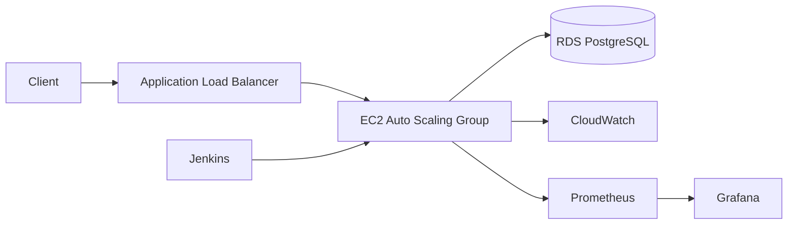

# Architecture Overview

## Components

- FastAPI application running in Docker on EC2 instances behind an Application Load Balancer
- PostgreSQL on Amazon RDS in private subnets
- VPC with public and private subnets, NAT Gateway, and Internet Gateway
- Jenkins pipeline for CI/CD and blue-green deployment
- Prometheus and Grafana for metrics and dashboards
- CloudWatch for logs and observability

## Mermaid Diagram

